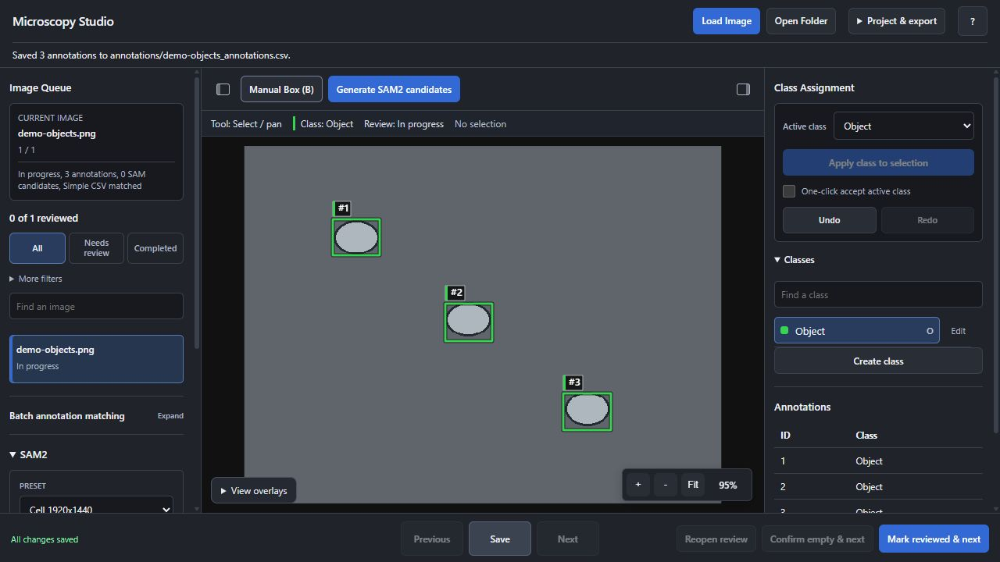

# Microscopy Studio

A local annotation tool for building object-detection datasets from microscopy images. Use SAM2 to suggest objects, or draw boxes yourself, then assign classes, review your images, and export the labels.


*The current interface, shown with synthetic objects and manually drawn boxes. No research or patient data is shown.*

- Open individual images or a folder, with search and review filters.
- Generate SAM2 candidates, draw and edit boxes, and undo or redo changes.
- Create your own classes, colors, and keyboard shortcuts.
- Keep projects separate and export CSV, YOLO, COCO, or Pascal VOC annotations.

## Get started

You need **Python 3.12** and the SAM2.1 large model. An NVIDIA GPU with a compatible driver is recommended; CPU inference is available but slower. The commands below use **Windows PowerShell and Conda**, from the repository folder.

```powershell
conda create -n microscopy-studio python=3.12 -y
conda activate microscopy-studio
python -m pip install -r requirements.txt
```

For NVIDIA acceleration, use the [official PyTorch installation instructions](https://pytorch.org/get-started/previous-versions/#v251) for **PyTorch 2.5.1 and torchvision 0.20.1**, matching this project's requirements and your GPU. A compatible CUDA-enabled build is needed for GPU inference.

Download the official [SAM2.1 large checkpoint](https://dl.fbaipublicfiles.com/segment_anything_2/092824/sam2.1_hiera_large.pt) into `models/sam2.1_hiera_large.pt`. Copy the included model configuration, then check and launch the app:

```powershell
New-Item -ItemType Directory -Force models | Out-Null
Copy-Item sam2/configs/sam2.1/sam2.1_hiera_l.yaml models/sam2.1_hiera_l.yaml
python scripts/check_setup.py
python app.py
```

Open **http://127.0.0.1:5000** in your browser. The app uses Waitress and runs locally; images are processed by your Python server.

## Annotate an image

1. **Open images.** Choose **Load Image** or **Open Folder**.
2. **Create classes.** Name the objects you want to label. Classes start empty in a new project.
3. **Add annotations.** Generate SAM2 candidates and assign a class to accept them, or use **Manual Box (B)** to draw your own. Select an annotation to edit its coordinates; Undo and Redo are available.
4. **Review.** Check the whole image, then choose **Mark reviewed & next**. Use **Confirm empty & next** only when there are no target objects. Both actions save before advancing.
5. **Export.** Open **Project & export**, choose a format, and export the current image. For a complete dataset, review every loaded image and choose **Export whole project (COCO)**.

**Save** stores annotations in the project's folder without marking the image reviewed. Pending annotation or class edits remain flagged as unsaved. Editing a reviewed image, or changing class names/IDs, requires another review. Unaccepted SAM candidates are not final annotations and are excluded from exports.

Use **?** for shortcuts. The side panels collapse to give the image more room. SAM2 presets cover routine use; device controls and tuning are under **Advanced settings**, with image preprocessing available separately. Active preprocessing affects both the display and SAM2 input while preserving the source file.

### Projects and saved work

Each `python app.py` launch starts a fresh project and archives the previous one. Reopen saved work through **Project & export → New / Open project**; refreshing the browser keeps the current project. After reopening a project, select its source images again.

Opening another image folder does not switch projects. One server has one active project, so other tabs must reload after a project switch. Back up the annotation folders, their `.review.json` sidecars, `project_manifest.json`, and `project_manifest.json.projects/` together. Previous saved file versions are retained as `.bak` recovery copies.

### Import and export

| Format | Best suited to | Contents |
|---|---|---|
| Simple CSV | Basic label exchange | Boxes and classes |
| Rich CSV | Keeping SAM2 information | Boxes, contours, and available model metadata |
| YOLO TXT | Object-detection training | Normalized boxes and class IDs |
| COCO JSON | Dataset interchange | Boxes and available SAM contours; current image or whole project |
| Pascal VOC XML | VOC-compatible tools | Boxes and classes |

The **current-image export format** is independent of the project's save/import format, which is set under **Batch annotation matching**. Use that panel to match and import labels across loaded images, or **Current-image import** for one file. Imports replace the affected annotations.

Current-image exports can contain draft work. Whole-project COCO export requires reviewed images and valid annotations; unresolved matches and invalid geometry block it. Confirmed-empty images become negative examples. Class IDs stay stable when classes are renamed or reordered; deleted IDs are not reused, so YOLO IDs may contain gaps. Keep the matching class-ID mapping with your training data.

## Supported images

Common formats include **PNG, JPEG, BMP, TIFF, and WebP**, plus single-frame GIF, JPEG 2000, PNM, PCX, TGA, SGI, ICO, QOI, and XBM. Some formats depend on codecs available in Pillow.

The app works with **single 2D images converted to 8-bit RGB**. It does not preserve scientific intensities, physical units, or channel metadata. Render a 2D plane first for multichannel data, Z-stacks, time series, whole-slide images, or DICOM. Ambiguous multipage images and animations are rejected; TIFFs with a supported reduced overview are accepted. RAW, HEIC/HEIF, AVIF, SVG/PDF, and proprietary microscopy formats need conversion.

EXIF orientation is applied before display and annotation. Pair exported labels with images normalized to that same orientation. Original files are unchanged. The default decoded-image limit is **25 million pixels**.

## Configuration and troubleshooting

Most settings can stay at their defaults. If SAM2 is unavailable, check both files in `models/` and run `python scripts/check_setup.py`. For memory errors, try a lighter preset or reduce sampling in Advanced settings. Load the image before importing YOLO labels so its dimensions are available.

For duplicate filenames, use path-specific annotation matching. On a shared server, configure authentication and network access deliberately; the default address is localhost. PHI-safe mode hides identifying filenames in the interface and exports, but does not anonymize image pixels.

<details>
<summary>Environment variables</summary>

Set variables in PowerShell before launching, for example: `$env:APP_PORT = "5001"`.

| Variable | Purpose |
|---|---|
| `APP_HOST`, `APP_PORT` | Bind address and port; default `127.0.0.1:5000` |
| `APP_API_TOKEN` / `API_TOKEN` | Optional API bearer token; clients send `Authorization: Bearer …` or `X-API-Token` |
| `PHI_SAFE_MODE`, `PHI_HASH_SALT` | Set mode to `1` and supply a secret salt for stable anonymized filenames |
| `ANNOTATION_OUTPUT_DIR` | Default annotation folder; `annotations` |
| `ANNOTATION_FORMAT` | Save/import default: `csv`, `csv_rich`, `yolo`, `coco`, or `voc` |
| `PROJECT_MANIFEST_FILE` | Project manifest; `project_manifest.json` |
| `PROJECT_SETTINGS_FILE` | Legacy settings file used during initial migration |
| `ALLOWED_CORS_ORIGINS` | Allowed browser origins, comma-separated |
| `MAX_UPLOAD_MB`, `MAX_DECODED_IMAGE_PIXELS` | Upload and decoded-image limits |
| `SAM_DEVICE` | `auto`, `cuda`, or `cpu` |
| `SAM_MAX_CONCURRENT_REQUESTS` | Concurrent inference jobs; default `1` |
| `SAM_QUEUE_TIMEOUT_SECONDS` | Queue wait limit; default `5` seconds |
| `SAM_INFERENCE_TIMEOUT_SECONDS` | Request wait limit for inference; default `300` seconds |
| `MAX_ANNOTATIONS_PER_SAVE`, `MAX_CLASSES_PER_PROJECT` | Annotation and class limits |
| `ALLOW_ABSOLUTE_ANNOTATION_DIR` | Set to `1` if absolute annotation paths are needed |
| `SKIP_SAM_MODEL_LOAD` | Set to `1` for UI/API work without inference |

The [example manifest](project_manifest.example.json) shows the project structure. Existing projects retain their saved settings.

</details>

<details>
<summary>Docker</summary>

The image downloads the SAM2.1 large checkpoint during the build. This example persists project state and annotations in `studio-data` and exposes the app only on localhost:

```powershell
docker build -t microscopy-studio .
docker run --rm -p 127.0.0.1:5000:5000 `
  -v "${PWD}/studio-data:/app/data" `
  -e PROJECT_MANIFEST_FILE=/app/data/project_manifest.json `
  -e ANNOTATION_OUTPUT_DIR=/app/data/annotations `
  microscopy-studio
```

For a local model mount, add `-v "${PWD}/models:/app/models"`; it must contain both model files. GPU use also requires a GPU-enabled container runtime and compatible PyTorch installation.

</details>

<details>
<summary>Development and tests</summary>

`app.py` coordinates the API; decoding, annotation formats, review persistence, and SAM2 inference have separate Python modules. The current UI uses `static/index-refined.html`, `script-refined.js`, and `style-refined.css`, with shared controllers. The preserved original interface is available at `?ui=original`; project-aware writes require the refined UI once a project library exists. Vendored upstream SAM2 code lives in `sam2/`.

Run tests with isolated runtime files and model loading disabled:

```powershell
python -m pip install -r requirements-ci.txt
New-Item -ItemType Directory -Force .tmp/tests | Out-Null
$env:SKIP_SAM_MODEL_LOAD = "1"
$env:PROJECT_SETTINGS_FILE = "$PWD/.tmp/tests/settings.json"
$env:PROJECT_MANIFEST_FILE = "$PWD/.tmp/tests/manifest.json"
$env:ANNOTATION_OUTPUT_DIR = "$PWD/.tmp/tests/annotations"
python -m pytest tests -q
python -m ruff check .
```

Node.js is needed for frontend tests. GitHub Actions runs the Python and frontend checks with CPU-only PyTorch. If Windows denies access to pytest temporary files, choose a new writable directory with `--basetemp`. Unset the test environment variables before returning to normal use, or open a new terminal.

</details>

## Acknowledgements

Microscopy Studio builds on **Meta FAIR's Segment Anything Model 2** and is not an official Meta project. Model weights are downloaded separately and are not committed here. If SAM2 contributes to your research, please cite [Ravi et al., *SAM 2: Segment Anything in Images and Videos* (2024)](https://arxiv.org/abs/2408.00714).

[Official SAM2 repository](https://github.com/facebookresearch/sam2) · [Project page](https://ai.meta.com/research/sam2/)
